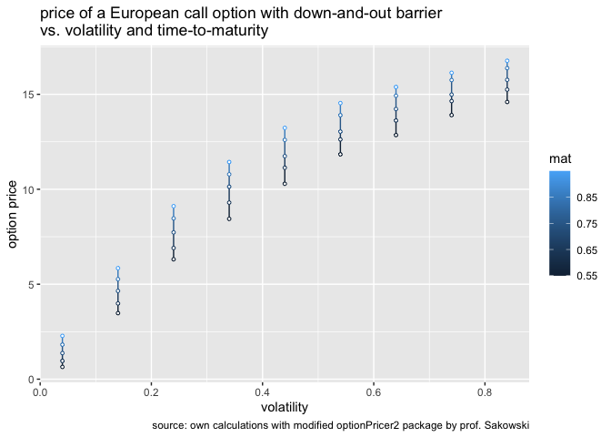

Applied Finance Options homework
================
Tomasz Starakiewicz
2023-01-29

## Package installation

``` r
# remove.packages("optionPricer2")
# devtools::install_github("tjstarak/DSBA-applied-finance", subdir = "pkg")
library(tidyverse)
```

## Introduction

The objective of this document is to examine the impact of the
time-to-maturity and the volatility of an underlying instrument on a
European call option with a down-and-out barrier.

## Assumptions

Key assumptions are:

- number of iterations for MC simulations: 10000
- barrier level: 80
- price of the underlying instrument at the moment of pricing: 95
- strike price: 100
- annualized volatility rate: 0.04 - 0.84
- time-to-maturity: 0.55 - 0.95
- risk-free rate: 0.07

## Option price

At volatility = 0.24 and time-to-maturity = 0.75, the option price is
between 7.5-8.0

``` r
optionPricer2::getEuropeanCallPrice(126, 100, 95, 0.24, 0.07, 0.75, 80, 10000) %>% 
  print()
```

    ## [1] 7.948246

## Sensitivity analysis

``` r
getMCEuropeanCallPriceWithSpotAndVol <- function (vol, maturity) {
  return(
    optionPricer2::getEuropeanCallPrice(126, 100, 95, vol, 0.07, maturity, 80, 10000))
}

mat <- seq(0.55, 0.95, by = 0.1)
vol  <- seq(0.04, 0.84, by = 0.1)

grid      <- expand.grid(vol = vol, mat = mat)
prices    <- mapply(getMCEuropeanCallPriceWithSpotAndVol, 
                    vol = grid$vol, mat = grid$mat)
result.df <- data.frame(grid, prices)
head(result.df)
```

    ##    vol  mat     prices
    ## 1 0.04 0.55  0.6447681
    ## 2 0.14 0.55  3.4770182
    ## 3 0.24 0.55  6.3135528
    ## 4 0.34 0.55  8.4400145
    ## 5 0.44 0.55 10.2896822
    ## 6 0.54 0.55 11.8393128

Even with barrier included, the valuation of the option increases with
volatility. This is in line with the intuition, as the upside is still
unlimited. Similarly, the longer the time to maturity, the higher the
valuation, as the range of expected outcomes is wider and still
unbounded from the top.

``` r
grid %>% 
  as_tibble() %>%
  bind_cols(price = prices) %>%
  ggplot(aes(x = vol, y = price, group = vol, colour = mat)) +
  geom_line() +
  geom_point(size = 1, shape = 21, fill = "white") +
  labs(
    x     = "volatility",
    y     = "option price",
    title = "price of a European call option with down-and-out barrier\nvs. volatility and time-to-maturity",
    caption = "source: own calculations with modified optionPricer2 package by prof. Sakowski")
```

<!-- -->
